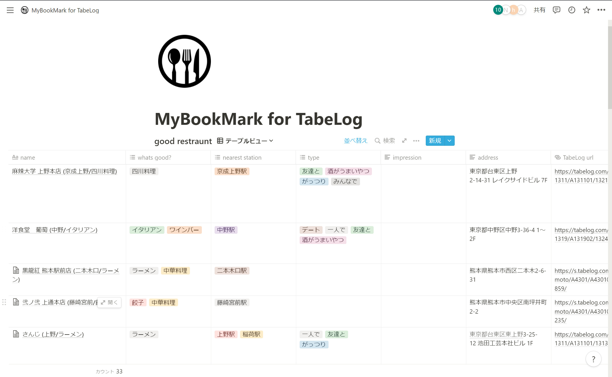

# prototype
---

## 今のところやったこと
- docker-composeでnode/nginx/mongodbコンテナ作って
- nodeコンテナにvueプロジェクト作った

## やってないこと
- nodeからmongodbに接続
- vueでフロント作る

## tree
gitで空ディレクトリどうしたら入るのかわからんからtree置いとく
```
.
├── README.md
├── docker-compose.yml
├── mongo
│   ├── configdb
│   ├── db
│   ├── dockerfile
│   └── init
├── nginx
│   ├── default.conf
│   └── dockerfile
└── node
    ├── dockerfile
    └── src
```

---

## やりたいこと
こんな感じ


以下zenn記事でざっくり書いたやつ
- https://zenn.dev/xianglishan/articles/ee6db4fc7dcbc8

これをそのうちwebアプリにする

## データをホストする方法
- Notionデータベースに置いといてapiたたいて持ってくる
    - 自分ら専用ならこれ
    - でもこれなら現状で十分じゃ?
- s3に各bookmarkspace用json置いてboto3とかで操作
    - 想定user少ないならこれでもいいか?
    - たぶんNotionのjsonまねて置いといたらいい気がするので楽
- s3に各bookmarkspace用csv置いてathena操作
    - csvなら複数選択は/とかで区切って置いとくか？
- RDSでmysql
    - これやるなら以下構成?
    
- mongodb
    - json でやれるからデータベース管理が(走り出しは)楽

## 以下機能のAPI作る
- bookmark一覧取得
- bookmark追加変更削除/項目の追加変更削除
- いい感じの検索
- signup/signin/signout
- teamを作る/teamのbookmarkspace作る/ユーザーの追加

## ユーザー認証
aws cognito使ってみたい

参考資料
- https://blog.linkode.co.jp/entry/2020/03/17/143612

## フロントはats?
